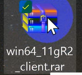
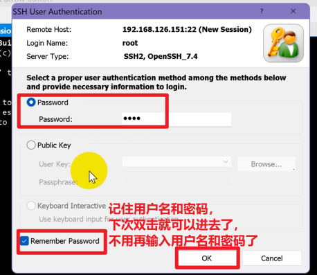

## 一、课前相关配置介绍

### 环境架构

VMware下虚拟机：Linux - centos + Oracle

Win机下：sqlplus、oem、mobaxterm、xshell、winscp

- sqlplus：Oracle客户端软件，对应压缩包 “win64_11gR2_client.zip”
- oem：用360极速模式打开，是Oracle提供的图形化界面管理器
- mobaxterm：用于远程连接虚拟机
  - 执行Linux命令：例如登录、编辑文件（vim）、切换用户（su）、执行脚本（.）
  - 在shell环境下执行Oracle的服务emctl的命令：例如emctl start dbconsole
    启动了之后，可以在网页访问 OEM
  - 执行sqlplus命令：操作数据库、设置SQL*Plus的运行环境（例如设置屏幕上每一行能够最多显示字符数）
- xshell：类似mobaxterm，用于远程连接虚拟机
  - xshell里复制黏贴的快捷键：ctrl/shift + insert（感觉比较麻烦，推荐 mobaxterm，右键即可粘贴）
  - xshell里回退键：ctrl+backspace
- winscp：在 Win机和 Linux虚拟机之间传输文件

### 安装sqlplus

★ 下面“连上 Oracle系统”和“Windows上通过 cmd连上Oracle”的部分步骤有用到sqlplus

★ 关于sqlplus的命令需要在win机上安装提供的压缩包“win6_11gR2_client.zip”，装了之后可以运行sqlplus（oracle客户端的一个工具）。

安装步骤如下：

1. 解压，在setup.exe右键，以管理员身份运行

   

2. 如果屏幕太小，就需要在兼容性里修改DPI

   

3. 会提示环境不满足要求，忽略此提示，继续以下操作。

   

   

   

   

4. 安装完之后，sqlplus这个命令就可以被找到了

### 账户密码

- Linux的：root/root，oracle/orcl
- Oracle的：sys/orcl，scott/tiger
  （ps：scott是 Oracle系统的样例用户）

### mobaxterm /xshell连接虚拟机

### 连接上虚拟机之后连上 Oracle系统

1. 切换到oracle用户：`su - oracle`

   - 加上“-”会到该用户的家目录
   - 对数据库的访问要切换成oracle用户，不能用root用户
     - 连接的时候一般是先登录到root，再切换到 oracle，但直接登录到 oracle用户也是可以的。
     - root和oracle是Linux系统下的用户，和数据库是没有关系的。
   - 在Oracle数据库中，通常不推荐使用root用户（即操作系统的超级用户）来进行数据库访问或管理。理由如下
     - 数据库操作应该基于"最小权限原则"，这意味着给予用户仅限于他们所需的权限，以完成其工作，而不应该给予超出需要的权限。root用户具有操作系统的超级权限，允许执行危险的系统级操作，例如更改操作系统设置、访问所有文件，这在数据库管理方面是不必要且危险的。
     - 数据库用户应该是有限制的，以减少潜在的风险。使用root用户来访问数据库会增加系统和数据库的安全风险，因为任何数据库操作都将在系统级别执行，这可能会导致意外的数据损坏或系统崩溃。
     - 数据库通常提供了审计和跟踪功能，以追踪用户的活动和更好地了解谁执行了哪些操作。如果所有数据库活动都使用root用户执行，将很难区分不同用户的操作。

2. 先运行一个环境的配置：`. oraenv`

   - 是运行设置Oracle环境的shell脚本（. 其实是 source 命令，执行shell文件）
   - oraenv是一个文件，点空格就是运行这个文件，它会帮忙把oracle的环境配好
   - 这个文件在当前路径里是找得到的（ls命令可以查看当前路径下的文件、文件夹），所以步骤 1最好加上“-”
   - 实例启动之后，要和数据库关联，这个关联其实就是这个文件指定的。
     ps：==一个实例对应一个数据库==

3. 输入实例名：orcl，回车，连上实例

4. 测试：用sqlplus工具连上/登上oracle，即输入 `sqlplus sys/orcl as sysdba`

   

   -  sqlplus是一个命令行的工具，sql加强的工具
   - as sysdba：是作为超级用户登录的再次验证，如果是登录普通用户就不需要加这两个了
   - 这种形式的连接是数据库里面的用户名和密码的验证
     后面学 sqlnet.ora 的配置会学到关于登录时的验证
   -  其实输入 `sqlplus / as sysdba` 也可以，因为此时已经连接上了服务器，所以不需要用户名和密码也可以直接登录上（在服务器上就有这个权限）

### Windows上通过 cmd连上Oracle

★ 前面是先连上虚拟机，再连上数据库，相当于在服务器面前操作；但是构造产品的话，对==普通用户==来说，是不会提供一个os的权限的，一般只是通过数据库的权限连过来。所以下面演示通过 Windows机连过来

> 普通用户通常只有普通用户的权限，可以执行查询和限定的管理任务，用于普通的应用程序开发和查询任务。
>
> 以 sys 用户连接到数据库，并指定角色为 sysdba 的方式，就有有更高的权限，可以执行各种数据库管理操作，如创建用户、备份和还原等。该高权限用户用于数据库管理员执行故障排除、备份和还原、数据库维护和监控等高级数据库管理任务。
>
> 总结：对系统的管理最好用 as sysdba登录，用Scott可能存在权限不够的情况

★ 在cmd里面输入：sqlplus scott/tiger@192.168.126.151:1521/orcl

- scott/tiger是Oracle系统里的一组用户名和密码

- 192.168.126.151是虚拟机的ip地址，Oracle系统在虚拟机/Linux里面
  后面的远程服务器的地址要写上，不然默认连接本机的，报错如下，但本课程的Oracle系统在虚拟机上。（模拟远程服务器）

  

- 1521是Oracle服务的端口号

- orcl是实例名。数据库都有实例的概念，你要连上的这个数据库，管理员会告诉你实例的名字，这里实例的名字是orcl。

这里是通过命令的方式连过来，要是通过GUI的方式也可以，但是配置也是一样的，也需要用户名和密码、服务器和端口号、实例名。

### 用户解锁和改密码

上面都是通过sys用户进行数据库的连接，Oracle系统还提供了一个普通用户 scott，默认情况下该用户被锁定，需要先解锁。

1. 用超级用户登录：sqlplus sys/orcl as sysdba
2. 解锁：alter user scott account unlock;
3. scott用户密码过期，修改密码：alter user scott identified by tiger;

至此，scott用户可以登录了。

方式1：直接在当前的 sqlplus下切换过去：conn scott/tiger
方式2：
先退出当前的sqlplus环境：exit 或 quit
再连接上：sqlplus scott/tiger

### 11g的  三种  主要的管理工具

####  sqlplus

[07Oracle自带客户端工具SQL Plus_哔哩哔哩_bilibili](https://www.bilibili.com/video/BV1Eq4y127K2/?p=7&spm_id_from=pageDriver&vd_source=e6711227b0ce09c2866b8d609bbe7b46)   

####  OEM

是一个web形式的EM

启动和停止

- 环境配置 ：. oraenv
  ps：win下是 set ORACLE_UNQNAME=orcl

- emctl stop / start / status dbconsole

####  数据库配置助手（database configuration assistant）

