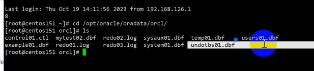

## 四、体系结构

### 前言

偏理论，大型数据库（不止Oracle）一般都是这么设计的。

理解了这一章，才知道大型数据库的软件是怎么设计的、里面是怎么操作的，基本上其他数据库也是这个结构的。当操作有问题的时候，从理论出发可以想想为什么会这样。如果对理论不了解，做了也不知道是怎么回事，出问题了也不知道怎么解决。

这门课学的是针对结构化的（关系型）的数据库，以后学的可能只是针对大数据（没有结构的）

### 服务器体系结构

#### 概览

==**内存 + 进程 = 实例**，**实例 + 数据库 = 一个oracle服务器**==

数据库服务器是指管理数据库的各种软件工具（比如sql plus、OEM等）、实例及数据库3个部分。

因为系统要做很多事情，所以分了不同的进程，比如专门进行读写数据、控制系统使用等等

oracle数据库本身是一个软件，启动后首先要分配一块内存。这块分配的内存得先建起来，如果内存不够，没有分配到，软件是启动不来的。

> 学了os就知道，数据是不能从磁盘里面直接读给客户端的，得从内存读。
> os的设计就是让客户端从内存读取数据，因为这样读取的效率/速度比较高。

#### ==关于实例==

每个数据库实例都与一个并且只与一个数据库关联。如果同一服务器上有多个数据库，那么每个数据库会有一个单独的数据库实例。

- 一个数据库可以被多个实例装载和打开：而一个实例在其生存期内只能装载和打开一个数据库。

实例是一系列复杂的内存结构和操作系统进程。

是一个非固定的、基于内存的基本进程与内存结构。当服务器关闭后，实例也就不存在了。

实例是指一组Oracle后台进程以及在服务器中分配的共享内存区域。

一个实例只对应一个数据库，一个数据库可以对应多个实例（当数据库很大，一个实例、一台服务器无法完成时，可以起另一个实例来执行任务）。

数据库实例不能共享。

一台主机里面可以起多个实例，但一个实例只能和一个数据库关联。

如果数据量很大，要服务的用户很多，只有一个实例可能服务不过来，那么可以建立一个集群的系统，就是几台机器连成一个集群，每台机器起一个实例，这些实例都是为同一个数据库服务。

从实例与数据库之间的辩证关系来讲，实例用于管理和控制数据库；而数据库为实例提供数据。

- 启动11g然后用这个实例来访问和控制磁盘中的数据文件。
- 当用户连接到数据库时，实际上连接的是数据库的实例，然后由实例负责与数据库进行通信，最后将处理结果返回给用户。
- 一个数据库可以被很多实例装载 & 打开。

一组后台进程和在服务器中分配的共享区域SGA

- 创建一个数据库，就有一个不共享的实例。
- SGA对应PGA：① 一个PGA对应一个服务器进程。 ② 一个 sqlplus就是一个服务器进程。

#### 关于服务器进程和用户进程

##### 总结

用户进程（前台进程）：是连接到 Oracle DB 的应用程序或工具

- 不属于实例的一部分，但是用户在不知不觉中经常会用到它，使用前台进程能够实现用户与实例的沟通。
- 是指那些能够产生或执行SQL语句的应用程序，eg sqlplus。

服务器进程

- 属于数据库进程

- 在连接到 Oracle实例，在用户建立会话时启动

- 数据库进程还有一个后台进程：启动Oracle实例时启动，完成Oracle实例的任务的

##### 具体内容

服务器起来之后，客户端要访问，客户端自己起一个用户进程（打一个sqlplus就是启动一个用户进程）。

客户端要访问数据，服务器要提供相应的服务，即要专门启动一个服务器进程。

用户进程是不在服务器里面的，比如 win下起了一个 sqlplus去连。

##### 在用户进程中有两个非常重要的概念：连接和会话

- 连接：用户进程和实例之间的通信。“连接”是用户进程和 Oracle DB实例之间的通信路径
- 会话：用户通过用户进程与实例之间建立的特定连接
  - 代表登录到数据库实例的当前用户的状态。

一个用户可以使用同一用户名创建多个会话，这些会话可以并存。

两个连接成功之后就有一个会话，服务进程里面会起一个监听来监听会话。

#### 关于后台进程

==【牢记：实例 = 内存 + 进程】==

数据写进程，缓冲区写入磁盘 DBWn（write）

日志写进程 LGWR

检查点进程 CKPT

系统监视器进程SMON

进程监视器进程 PMON

恢复器进程

归档进程 ARCN

#### 关于内存

★ 概览

内存可以分成两大块：SGA、PGA。

##### SGA

###### 共享池

- 库高速缓存 
  - 服务器为用户服务的时候，用户执行增删改查的语句，oracle收到语句之后会进行编译，如果没有语法问题，就会放在共享池里。
  - 执行的时候就在共享池里找（PL/SQL程序代码和sql语句），找到之后就直接执行这个语句。
  - 例如张三已经执行过某条语句，那么李四看到共享池里有，也可以再执行【不同用户共享】
- 数据字典高速缓存
  - oracle系统是自维护的，数据库里面的东西都放在自己的数据库里面。而数据库在运行的过程中，经常访问到自维护的数据字典表和视图。来查询用户信息、数据库的结构信息、包含什么表等信息（这些都在数据字典里面，而且这个数据字典在数据库运行过 程中经常访问）。
  - 数据字典也是放在数据库里面，数据库也要把这些调出来放在内存里面去，并且放在内存里的数据字典高速缓存区里面（而不是每次都从磁盘里面读，那样是比较慢的）。

###### DB 缓冲区高速缓存

- 存放从数据文件读取的数据块的副本，所有并行用户共享。
- 就是把数据从磁盘放到内存。
- 改数据，也是先改缓冲区的，再写回数据文件里面去。因为如果直接修改磁盘文件，回滚会很浪费时间。

###### 重做日志缓冲区

- 是SGA中的循环缓冲区。
- 存放有关对数据库所做更改的信息。==对数据进行更改，先由重做日志缓冲区记录下对数据的修改，然后才在数据缓冲区中进行修改。==这里用来来记录哪些更改的过程信息 ， 便于进行恢复、重做业务等。
- 类似上一个缓冲区，也是先写到一个内存区域，然后写到重做日志文件里面。

###### 大型池

- 进行数据恢复、备份还原的时候需要用到  这样一大片内存   来进行大量的 io 操作。

###### Java 池和流池 

- Java池内存用于存储JVM中所有特定于会话的Java代码和数据。

###### 缓冲池区

- 需要才建立，都是放数据的地方

##### PGA

每个服务进程里面也有一块内存，叫PGA

- 即PGA是在服务进程（为用户/客户端服务的一块内存）

- 因为是为用户服务，所以用户的数据放在“用户全局区 UGA”里面

  

- 如果一个服务进程专门为一个用户服务，那么是专用模式；否则是共享模式，此时 UGA 会放入共享池。

### 结构

数据库的主要功能就是存储数据，数据库存储数据的方式通常称为存储结构，Oracle数据库的存储结构分为逻辑存储结构和物理存储结构。

- 逻辑存储结构用于描述Oracle内部组织和管理数据的方式

- 物理存储结构用于展示Oracle在操作系统中的物理文件组成情况

物理文件在存储上本身有个逻辑结构，就是对数据的操作是有一个逻辑结构（是为了更好地组织系统，数据不能随便乱放在文件里）。

表空间内放数据文件，表空间大小可以一直增加。

> 一个磁盘满了，可以再创建一个磁盘，把数据文件加到这个表空间里面。
>
> 段也可以很大，因为可以一部分段放在这个数据文件，另一部分放在另一个数据文件。

### 逻辑存储结构

逻辑存储结构是Oracle数据库存储结构的核心内容，对Oracle数据库的所有操作都会涉及逻辑存储结构。逻辑存储结构是从逻辑的角度分析数据库的构成，是对数据存储结构在逻辑概念上的划分。

- Oracle的逻辑存储结构是一种层次结构，主要由表空间、段、区间和数据块等概念组成。
- 逻辑结构是面向用户的，当用户使用Oracle设计数据库时，其使用的就是逻辑存储结构。
- Oracle的逻辑存储结构中所包含的多个结构对象从数据块到表空间形成了不同层次的粒度关系。

#### 关于表空间

★ 划分意义

- 不同的数据放在不同的表空间，可以提高表空间的使用效率和减少表空间的碎片。
- 系统表空间是经常要读的，如果用户的表也放进来，那么两种表可能在同一个数据文件里，会影响系统数据的读取。
  - 数据的io可能在同一条通道
- 放在不同的数据文件，或者是放在不同的磁盘，那么就可以合理地设置io通道，效率会比较高。
- 最简单的：把表空间分成系统表空间、用户表空间；或者可以这些地方放表，那些地方放索引。
  - 从应用的角度来讲：这个区域放销售数据、那个区域放财务数据。

★ select * from v$tablespace;

##### 系统表空间

存放系统数据：Oracle是自维护的系统，系统本身有很多表（dict表、用户密码表）。

SYSTEM和SYSAUX表空间是在创建数据库时创建的必需存在的表空间。这些表空间必须联机。

SYSTEM表空间关于核心功能（例如数据字典表)

辅助的SYSAUX表空间用于附加的数据库组件(如Oracle Enterprise Manager Repository)。

不建议使用SYSTEM和SYSAUX表空间来存储应用程序的数据

##### 用户表空间

存放用户数据

### 存储（体系）结构

★ 数据库是由基于磁盘的数据文件、控制文件、日志文件、参数文件和归档日志文件等组成的物理文件集合。

★ 逻辑存储结构是为了便于管理Oracle数据而定义的具有逻辑层次关系的抽象概念，不容易理解；但物理存储结构比较具体和直观，它用来描述Oracle数据在磁盘上的物理组成情况。

★ 从大的角度来讲，Oracle的数据在逻辑上存储在表空间中，而在物理上存储在表空间所包含的物理文件（即数据文件）中。

三个必须文件（下方介绍） + 其他重要文件（可选，如果有的话系统性能会更好）

★ 操作系统上可以看到的，三类，物理上的文件

#### 数据文件

放在磁盘里面，永久保存。

通过dba_data_files或v$datafile数据字典来了解Oracle系统的数据文件信息。

select file_name,tablespace_name from dba_data_files;【就可以看到有三种类型的数据文件】

- 系统数据文件 SYSTEM01.DBF，SYSAUX01.DBF

  - 用于存放特殊”的用户数据和Oracle系统本身的数据，如用户建立的表名、列名及字段类型等，这些属于用户数据范畴，这些数据被存放在系统表空间所包含的数据文件中；

  - 而Oracle系统内部的数据字典、系统表（如dba_data_files、dba_temp_fles等）中所存储的数据属于Oracle系统的内部数据，这些数据也存放在系统表空间所包含的数据文件中。

- 撤销数据文件 UNDOTBS01.DBF

  - 撤销数据文件隶属于撤销表空间。

  - 如果修改Oracle数据库中的数据，那么就必须使用撤销段，撤销段用来临时存放修改前的旧数据，而撤销段通常存放在一个单独的撤销表空间中，这个撤销表空间所包含的数据文件就是撤销数据文件。

- 用户数据文件 USERS01.DBF，EXAMPLE01.DBF、TBSP_1.DBF和TBSP_2.DBF

  - 存放用户应用系统的数据，这些数据包括与应用系统有关的所有相关信息，比如，图2.6中的TBSP1.DBF和 TBSP2.DBF文件就是一个具体应用系统的两个数据文件。

- ps：没有看到临时表空间所包含的数据文件
  - 这是由于临时数据文件本身的特殊性，从Oracle9i以后，Oracle将临时表空间所对应的临时数据文件与一般数据文件分开，要了解Oracle系统的临时数据文件信息，可以从dba_temp_files或v$tempfile数据字典中查询。

#### 控制文件

[Oracle控制文件解析_20210608_哔哩哔哩_bilibili](https://www.bilibili.com/video/BV1Jf4y187ak/?spm_id_from=333.999.0.0&vd_source=e6711227b0ce09c2866b8d609bbe7b46)

系统启动时，判断数据文件和重做日志文件里面写的是否一致。不一致是不能对外（用户）服务的。对数据库至关重要，没有他，无法打开数据库 。

会记录数据文件、重做日志文件分别写到哪个点了，看两个点是否一致。

不止启动，平时也运作；总的来说，就是对系统进行控制。而且有多个，一个坏了，其他的也可以对系统进行控制。

控制文件是二进制文件，DB运行过程中连续被使用。

控制文件记录了物理DB的状态信息，是维护数据库完整性的一部份。

如果丢失，需要Recovery，所以建议做多工（镜像）。即为了提高数据库的安全性，至少要为数据库建立两个控制文件，并且这两个控制文件最好分别保存在不同的磁盘中，这样就可以避免产生由于某个磁盘故障而无法启动数据库的危险，该管理策略被称为多路复用控制文件。通俗地说，多路复用控制文件是指在系统不同的位置上同时存放多个控制文件的副本。

在这种情况下，如果多路复用控制文件中的某个磁盘发生物理损坏导致其所包含的控制文件损坏，数据库将被关闭（在数据库实例启动的情况下），此时就可以利用另一个磁盘中保存的控制文件来恢复被损坏的控制文件，然后再重新启动数据库，达到保护控制文件的日的。

只能关联一个DB。

select name from v$controlfile;

#### 重做日志文件

ps：关于二重写机制

分组，每组固定大小；也是放在磁盘里面，当数据崩溃的时候，里面的还是保存着。

select member from v$logfile;

#### 参数文件

定义实例启动时的配置。

比如系统启动的时候需要内存，如果我们可以根据系统的需要和电脑的性能来写分配的内存的大小，那么会启动地比较优。

Way1：查询视图  v$parameter：来确定参数的默认值是否被修改过，以及是否可以用ALTER SYSTEM.和ALTER SESSION命令修改

Way2：SQL*Plus的show parameter命令显示服务器的参数

#### 口令文件

使用sysdba、sysoper和sysasm远程连接到实例并执行管理任务。

系统崩溃之后要进行恢复，数据库是自维护的系统，需要登录进去才能进行维护，但是此时系统已经崩溃了，要登录进去的话，密码又看不到（是系统无法打开表进行验证用户和密码），无法恢复

- （虽然 as sysdba 可以不用密码就登录进去，但是严格的系统里面是不允许这样的，需要用验证过的用户和密码才能登录）

所以，为了保障安全性，即虽然系统崩溃了，还是需要验证一下才能登录进去，于是在数据库外有一个口令文件

- 这是 OS 的层面上保存的一个文件，里面放“超级用户”的名和密码（这和数据库系统里面的超级用户是不一样的，是单独的；而且这个也是加密的，不能随便打开）

#### 备份文件

进行数据库恢 复。介质出现故障或因用户错误而损坏或删除原始文件时，通常会还原备份文件。

#### 归档重做日志文件

数据更改（重做）的实时历史记录。使用这些文件和数据库备份，可以恢复丢失的数据文件。也就是说，使用归档日志可以恢复还原的数据文件。

是重做日志删掉/清理之前的备份。

和重做日志文件不同，重做日志文件是必须的，没有无法启动数据库。

#### 预警日志

一般的情况（磁盘满了/某个用户进行了登录）：是放在预警日志文件里面。

#### 跟踪文件

每个服务器和后台进程都可以写入一个关联的跟踪文件。当进程检测到内部错误时，会将该错误的信息转储到相应的跟踪文件中。

当发生严重的情况：当要读取的某个块读取不出来，系统出问题了，就会生成跟踪文件，告诉你哪个块，这可能是磁盘损坏了，这个我们是能直接看的。（出现一次大问题就生成一个文件）

### 与Oracle DB交互

1. 在安装了Oracle DB的节点（主机或数据库服务器）启动实例。 
2. 用户启动应用，衍生用户进程。该应用尝试与服务器建立连接 
3. 服务器运行监听程序。监听程序检测应用程序发出的连接请求，并创建一个代表用户进程的专用服务器进程。 
4. 用户运行一条DML类型的SQL语句并提交事务处理。例如，用户更改表中的客户地址并提交更改。
5. 服务器进程接收该语句，并检查共享池（一个SGA组件）中是否有包含相同SQL语句的共享SQL区域。如果找到共享SQL区域，服务器进程将检查用户对于所请求数据的访问权限，然后使用现有的共享SQL区域处理该语句。如果未找到共享SQL区域，则为该语句分配一个新的共享SQL区域，以便对该语句进行语法分析和处理。
6. 服务器进程从实际数据文件（表）或数据库缓冲区高速缓存中存储的值中检索任何必需的数据值。
7. 服务器进程修改SGA中的数据。因为已提交事务处理，所以日志写进程会立即在重做日志文件币记录该事务处理。数据库写进程在一个高效的时机将修改后的块永久写入磁盘。
8. 如果事务处理成功，服务器进程将通过网络向应用程序发送条消息。如果事务处理不成功，则传送一条错误消息。 
9. 在整个过程中，其它后台进程也在运行，监视是否有需要干预的情况。此外，数据库服务器管理其他用户的事务处理，并防止请求相同数据的事务处理之间发生争用。