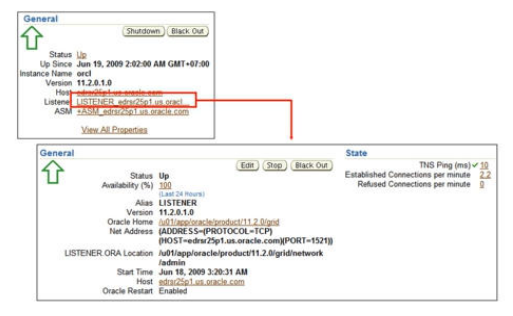

## 九、网络配置

### Oracle Net

是数据库网络通信组件，用于服务器和客户端之间的通信，涉及到配置文件，两端都有相应的配置文件。

#### 配置文件

★ 文件的意义：统一配置 + 简化连接

**1. 客户端 tnsnames.ora**

包含了连接数据库所需的信息（实例别名、主机地址、端口号…），用这些信息来定位并连接到对应数据库实例。

★ 配置使可以通过本地网络服务名访问远程 Oracle 服务器

- 手动配比较麻烦，所以用 客户端自带的 网络配置程序（Net Configuration Assistant） 进行配置

- 配置完成后，在客户端的 cmd里用 sqlplus scott/tiger@mytest 即可连接上，即出现 SQL> 提示符。
- 配置完成后，在客户端sqlplus的安装目录下的 product/11.2.0/client_1/network/admin/tnsnames.ora 中可以看到刚刚配的信息。

**2. 服务端 listener.ora**

位于服务端，配置了数据库实例连接的相关信息（监听器名称、协议、监听地址…），负责接收客户端请求，并将其传给对应的数据库实例。

**3. sqlnet.ora**：

关于连接、安全、性能，以影响服务器和客户端的行为。

- 连接属性：连接超时、重试次数等
- 安全性设置：加密、数据完整性检查等
- 性能调整：数据包、缓冲区大小等

与其他两个配置文件相比，是对连接的细节和性能做更细致的调整。

- 让sys用户不采用操作系统验证，而用数据库方式验证
  - ① 在shell里：vim $ORACLE_HOME/network/admin/sqlnet.ora
  - ② 添加：SQLNET.AUTHENTICATION_SERVICES=(NONE)
  - ③ 用 “wq!” 强制退出
  - 然后，用 sqlplus / as sysdba 会显示权限不足，登录失败。得加上用户名和密码。
- 在客户端设置，使其允许用 tcp/ip 连接串连接到数据库服务器，即支持 tcp/ip 连接方式/模式
  - 在客户端 sqlplus 安装目录下的 product/11.2.0/client_1/network/admin/sqlnet.ora 下配上 NAME.DIRECTORY_PATH=(ezconnect)

### 管理监听器

1. OEM的监听程序主页

   

2. oracle用户在shell下

   - 输入 lsnrctl 进入工具
   - 在 LSNRCTL 的提示符下输入 status 检查监听是否正常

★ 启动数据库之后，监听程序可以接受数据库连接请求。如果远程连接数据库失败，可以用以上两种方法排查。

★ lsnrctl 命令：是个 Linux 程序，是 Oracle Net 监听器适用控制程序，用于管理、控制 Oracle 数据库监听器。

